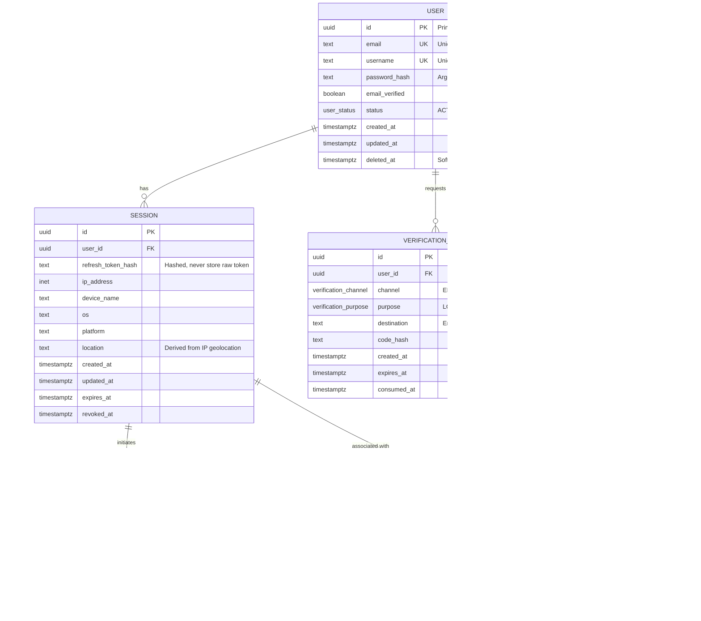

# Authentication-Service
An authentication service handling user registration, login via credentials or QR, 2FA, and device management.

# Database Schema

```mermaid
erDiagram

    USER {
        uuid id PK "Primary key"
        text email UK "Unique login identifier"
        text username UK "Unique display handle"
        text password_hash "Argon2/bcrypt hash"
        boolean email_verified
        user_status status "ACTIVE, SUSPENDED, DEACTIVATED"
        timestamptz created_at
        timestamptz updated_at
        timestamptz deleted_at "Soft delete marker"
    }

    SESSION {
        uuid id PK
        uuid user_id FK
        text refresh_token_hash "Hashed, never store raw token"
        inet ip_address
        text device_name
        text os
        text platform
        text location "Derived from IP geolocation"
        timestamptz created_at
        timestamptz updated_at
        timestamptz expires_at
        timestamptz revoked_at
    }

    VERIFICATION_CODE {
        uuid id PK
        uuid user_id FK
        verification_channel channel "EMAIL, SMS"
        verification_purpose purpose "LOGIN_2FA, EMAIL_VERIFICATION, etc."
        text destination "Email or phone the code was sent to"
        text code_hash
        timestamptz created_at
        timestamptz expires_at
        timestamptz consumed_at
    }

    QR_LOGIN_REQUEST {
        uuid id PK
        uuid session_id FK
        text code_hash
        qr_login_status status "PENDING, APPROVED, DENIED, EXPIRED"
        timestamptz created_at
        timestamptz expires_at
        timestamptz approved_at
    }

    AUDIT_LOG {
        uuid id PK
        uuid user_id FK
        uuid session_id FK
        audit_event event
        inet ip_address
        text user_agent
        jsonb metadata "Flexible event-specific payload"
        timestamptz created_at
    }

    USER ||--o{ SESSION : "has"
    USER ||--o{ VERIFICATION_CODE : "requests"
    SESSION ||--o{ QR_LOGIN_REQUEST : "initiates"
    USER ||--o{ AUDIT_LOG : "generates"
    SESSION ||--o{ AUDIT_LOG : "associated with"
```
